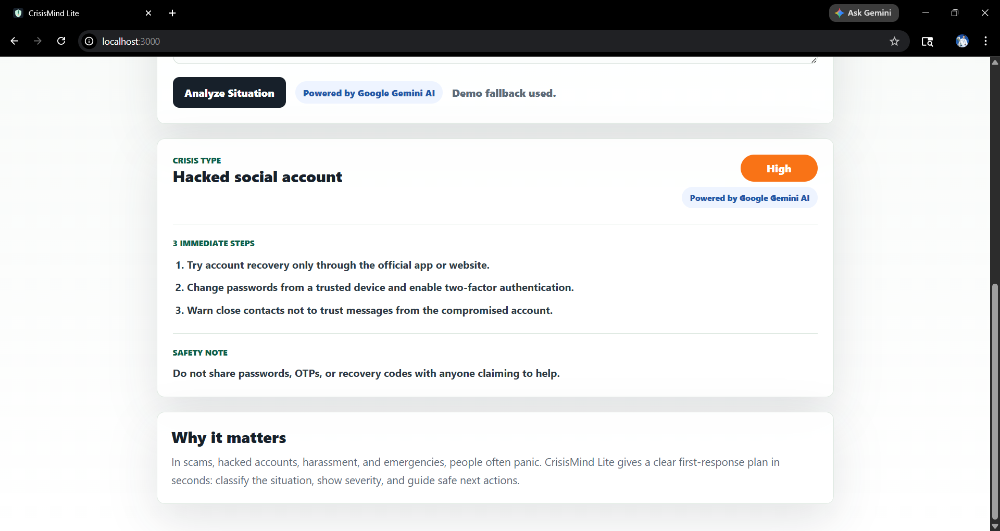

# CrisisMind Lite

**One-line tagline:**  
AI first-response crisis triage assistant powered by Google Gemini AI.

CrisisMind Lite is a lightweight AI-powered prototype built for Solution Challenge 2026 / Build with AI. It helps users respond faster during urgent digital and physical safety situations by converting free-text descriptions into a simple, structured first-response plan.

## Problem Statement

During scams, hacked accounts, online threats, and physical emergencies, people often panic and do not know what to do first. Search results can be slow, official help pages can be hard to navigate, and long chatbot answers are not ideal in moments of urgency.

CrisisMind Lite addresses this by giving users a short, immediate response: identify the crisis, show the severity, list three first actions, and surface a safety note.

## Solution Overview

The user describes a situation in plain language. The app sends that text to a small Node.js server, which calls Google Gemini and asks for a compact structured response. The UI then renders the output as a clear result card with:

- Crisis Type
- Severity
- Immediate Actions
- Safety Note

This keeps the experience fast, understandable, and suitable for non-technical users.

## Why This Is Not Just A Chatbot

CrisisMind Lite is designed as a focused first-response triage tool, not an open-ended chat interface.

- It uses constrained structured output instead of free-form conversation.
- It highlights urgency with a visible severity label.
- It is optimized for first actions, not long explanations.
- It includes a persistent safety disclaimer to reduce over-reliance on AI.
- It is intentionally narrow: crisis classification, first actions, and safety guidance.

## Features

- One-page crisis triage interface.
- Free-text situation input.
- Clickable sample prompts for fast demo flow.
- Powered by Google Gemini AI.
- Structured output with:
  - Crisis Type
  - Severity
  - 3 Immediate Actions
  - 1 Safety Note
- Safety-first UI disclaimer.
- Lightweight fallback guidance if Gemini is unavailable.
- No authentication.
- No database.
- No heavy frontend framework.

## Powered By Google Gemini AI

Google Gemini is used as the core intelligence layer behind the prototype. It classifies the situation, estimates severity, and generates short action-oriented guidance. The app keeps the Gemini API key on the server side and does not expose it to the browser.

## SDG Alignment

- **SDG 3: Good Health and Well-being**  
  Helps users respond more calmly and safely during stressful incidents.

- **SDG 9: Industry, Innovation and Infrastructure**  
  Demonstrates a practical AI triage workflow using modern cloud-ready architecture.

- **SDG 11: Sustainable Cities and Communities**  
  Supports safer first responses to emergencies such as fire or building threats.

- **SDG 16: Peace, Justice and Strong Institutions**  
  Encourages safer escalation, evidence preservation, and official-channel reporting during scams, account compromise, and harassment.

## Tech Stack

- **Frontend:** HTML, CSS, JavaScript
- **Backend:** Node.js built-in HTTP server
- **AI:** Google Gemini API
- **Deployment target:** Render or any Node-capable host

> The current working submission intentionally stays lightweight and does not use a heavy framework. That keeps the demo fast, reliable, and easy to evaluate.

## Architecture

1. **User Input Layer**  
   The user describes a suspicious or urgent situation in a single text box or selects a sample prompt.

2. **Gemini Analysis Layer**  
   The Node server sends the situation to Gemini with a constrained prompt asking for short structured JSON.

3. **Structured Response Rendering**  
   The browser displays the crisis type, severity, immediate actions, and safety note in a simple result card.

4. **Safety Disclaimer Layer**  
   The UI reminds the user that the result is AI guidance only and that immediate danger should be escalated to local emergency services.

5. **Fallback Behavior**  
   If Gemini is unavailable, the app still returns basic safety-first guidance for core demo scenarios.

## How Gemini Is Used

Gemini is called from the server through the Google Generative Language API. The prompt instructs Gemini to:

- classify the crisis in short plain English
- assign one of four severity levels
- provide exactly three immediate actions
- provide one short safety note
- avoid hallucinated emergency numbers

The server validates the shape of the returned content and falls back to rule-based guidance if the AI response fails.

## How To Run Locally

### 1. Clone the repository

```bash
git clone https://github.com/tauqxxr7/crisismind-lite.git
cd crisismind-lite
```

### 2. Create a local environment file

```bash
cp .env.example .env.local
```

### 3. Add your Gemini API key

```env
GEMINI_API_KEY=your_gemini_api_key_here
```

### 4. Start the app

```bash
npm start
```

### 5. Open the prototype

```text
http://localhost:3000
```

## Environment Variables

- `GEMINI_API_KEY` - required for live Gemini analysis

## Demo Flow

Suggested judge flow:

1. Open the homepage and show the tagline and safety disclaimer.
2. Click **OTP scam message** and run analysis.
3. Show the **High** severity output and immediate actions.
4. Click **Hacked Instagram account** and show account recovery guidance.
5. Click **Fire in building** and show the **Critical** severity result.
6. Mention the **Threats and leaked photos** scenario to show broader crisis coverage.

## Screenshots

### Home / Analyzer


### OTP Result


### Hacked Account Result



### Fire Result


## Future Scope

- Regional emergency support configuration
- Better category-specific prompting for harassment and fraud
- PDF export or structured incident handoff
- Lightweight analytics on prompt categories and response reliability
- Expanded crisis scenarios and multilingual support
- Cloud deployment with monitoring and versioned prompt iteration

## Render Deployment

To deploy on Render:

- **Build command:** `npm install`
- **Start command:** `npm start`
- **Environment variable:** `GEMINI_API_KEY`

Render will run the Node server directly, and the Gemini key will stay server-side.

## Submission Links

- **Demo Video:** `[Add demo video link]`
- **Live Prototype:** `[Add deployed app link]`
- **PPT:** `[Add submission PPT link]`
