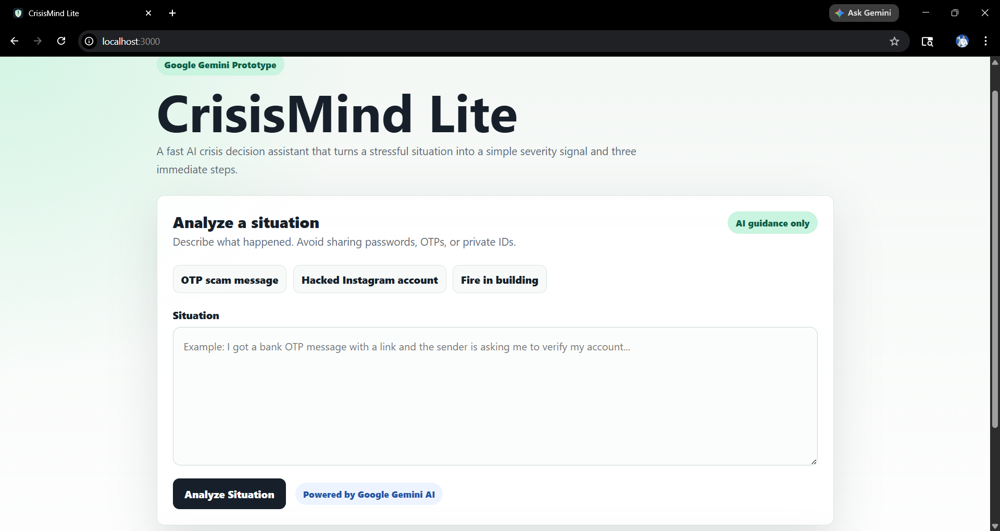
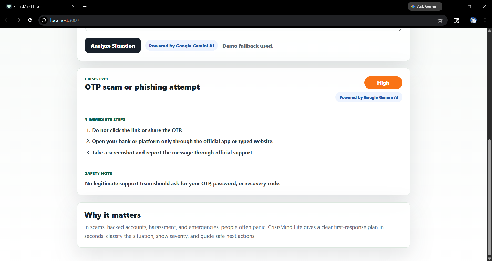
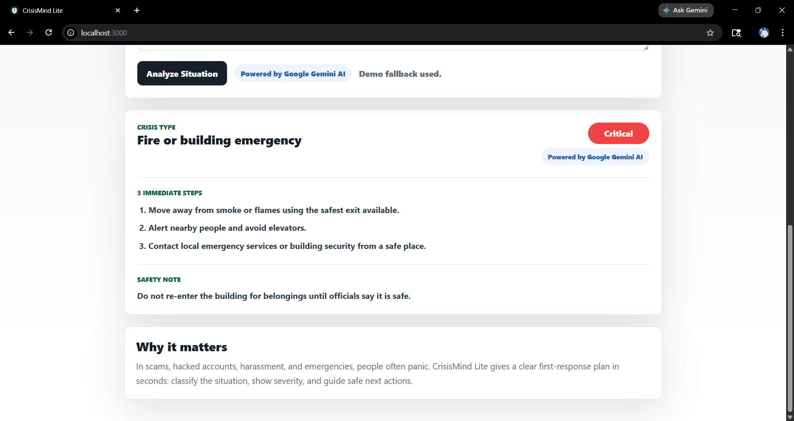

# CrisisMind Lite

**CrisisMind Lite** is a lightweight AI-powered crisis decision assistant built for a hackathon prototype submission. It helps users quickly understand urgent situations such as OTP scams, hacked social accounts, and building fire risks by generating a clear crisis type, severity level, three immediate steps, and a short safety note.

The prototype is intentionally simple and demo-ready: one page, no authentication, no database, and no complex setup.

## Problem Statement

People often panic during urgent digital or physical safety incidents. A user who receives a suspicious OTP message, loses access to a social account, or sees smoke in a building may not know what to do first.

Search results can be slow, support pages can be confusing, and generic chatbot responses may be too long during stressful moments. CrisisMind Lite focuses on quick first-response guidance: classify the situation, show urgency, and provide immediate next steps.

## Features

- Clean one-page web interface.
- Free-text crisis situation input.
- `Analyze Situation` button for instant triage.
- Visible **Powered by Google Gemini AI** label in the demo UI.
- Google Gemini-powered analysis through a small Node.js server.
- Output includes:
  - Crisis Type
  - Severity
  - 3 Immediate Steps
  - One short Safety Note
- Built-in sample prompts:
  - OTP scam message
  - hacked Instagram account
  - fire in building
- Safety-first fallback responses if Gemini is unavailable.
- API key stays server-side and is not exposed in browser JavaScript.
- No database, no authentication, and no frontend framework required.

## Tech Stack

- **Frontend:** HTML, CSS, JavaScript
- **Backend:** Node.js built-in HTTP server
- **AI:** Google Gemini API
- **Styling:** Custom responsive CSS
- **Deployment-ready for:** Any Node-capable hosting platform such as Render, Railway, or similar services

## How To Run Locally

### 1. Clone the repository

```bash
git clone https://github.com/tauqxxr7/crisismind-lite.git
cd crisismind-lite
```

### 2. Create an environment file

Copy the example file:

```bash
cp .env.example .env.local
```

Add your Gemini API key:

```env
GEMINI_API_KEY=your_gemini_api_key_here
```

### 3. Start the app

```bash
npm start
```

### 4. Open in browser

```text
http://localhost:3000
```

No dependency installation is required because this prototype uses only Node.js built-in modules.

## Demo Flow

Use this flow for a short judging demo:

1. Open `http://localhost:3000`.
2. Click the **OTP scam message** sample prompt.
3. Click **Analyze Situation**.
4. Show the generated Crisis Type, Severity, Immediate Steps, and Safety Note.
5. Repeat with **hacked Instagram account** to demonstrate digital account recovery guidance.
6. Repeat with **fire in building** to show critical physical safety escalation.

Suggested narration:

> CrisisMind Lite is not a generic chatbot. It is a focused crisis triage tool that converts a stressful situation into a short, structured action plan.

## Screenshots

Add final prototype screenshots here before submission. The simplest approach is to create a folder named `screenshots`, add PNG/JPG files there, commit them, and reference them using GitHub Markdown.

### How To Add Images In GitHub Markdown

1. Create a folder:

```text
screenshots/
```

2. Save your screenshots with simple names:

```text
screenshots/home.png
screenshots/otp-result.png
screenshots/hacked-instagram.png
screenshots/fire-result.png
```

3. Add images in this README using this syntax:

```md




```

4. Commit and push:

```bash
git add screenshots README.md
git commit -m "Add prototype screenshots"
git push
```

### Home / Analyzer


### OTP Scam Result


### Hacked Instagram Result


### Fire Emergency Result


## Project Structure

```text
.
|-- index.html
|-- styles.css
|-- app.js
|-- server.js
|-- package.json
|-- .env.example
|-- PITCH.md
`-- public/
    `-- favicon.svg
```

## Submission Summary

CrisisMind Lite demonstrates how AI can support safer first responses during urgent situations. It is fast, understandable, and practical for non-technical users who need immediate guidance.

The current prototype prioritizes reliability and demo-readiness over complexity, making it suitable for a hackathon MVP.
